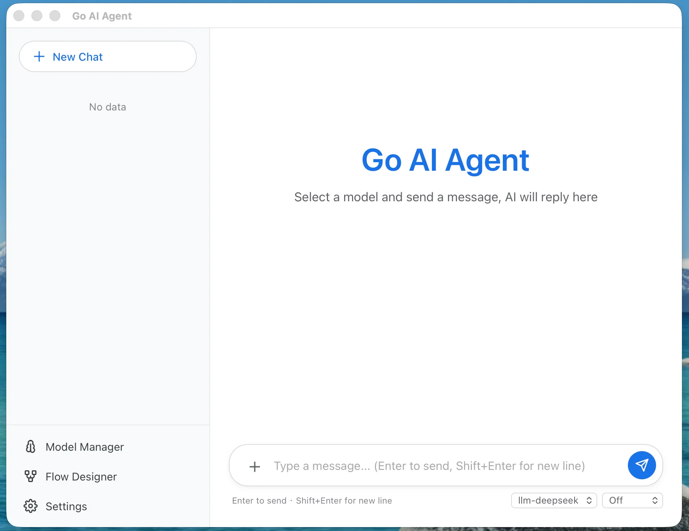

# Go AI Agent

> 🚧 **Work in progress** — this project is under active development.

A cross-platform desktop AI agent platform. **Create AI workflows by chatting** — describe what you want in natural language, and the agent designs, builds, and executes the pipeline for you.

Built with **Wails v2** + **React** + **Go**.

[简体中文](README.zh-CN.md) | [繁體中文](README.zh-TW.md) | [日本語](README.ja.md)



## Why Chat-Created Workflows?

Traditional workflow tools require learning a visual editor — dragging nodes, wiring edges, configuring parameters. With Go AI Agent, you just tell the agent what you need:

> *"Create a flow that fetches the latest AI news, summarizes them with DeepSeek, translates the summary into Japanese, and asks me to review before saving."*

The agent will **understand your intent → propose a node structure → confirm with you → create the flow**. No manual wiring, no config guesswork.

## Features

- **Chat-Created Workflows** — Build AI pipelines through natural language conversation with the `manage_flows` tool
- **Visual Flow Designer** — Drag-and-drop DAG editor with 16 node types including condition, switch, execute, script
- **Script-Based Nodes** — Condition and switch nodes use Starlark (Python dialect) expressions with access to all upstream data
- **Generic Batch Processing** — ForEach and Iterator nodes invoke any function with args, not hardcoded to LLM
- **Desktop App** — Native Windows/macOS/Linux window via Wails v2
- **One-Step Setup** — Desktop mode auto-configures SQLite + admin account, only model API key needed
- **Shareable Flows** — Export flows as ZIP packages (flow.json + meta.json), import with one click
- **Multi-Model** — OpenAI, Claude, Gemini, DeepSeek, and 28+ providers via unified interface
- **Agent Tool Use** — Extensible tool registry with manage_flows, manage_models, execute_command, read_document, web_search
- **Web Mode** — Run as a browser-based server via `cmd/server/main.go`
- **i18n** — English, 简体中文, 繁體中文, 日本語

## Quick Start

### Desktop App (Windows)

```bash
# Prerequisites: Go 1.25+, Node 18+, pnpm
go install github.com/wailsapp/wails/v2/cmd/wails@latest

git clone https://github.com/chuccp/go-ai-agent.git
cd go-ai-agent

# One-click dev mode
dev.bat

# Or manually
wails dev
```

First run auto-configures SQLite and creates a default admin account (admin/admin). You only need to configure your model API key.

### Web / Server Mode

```bash
go build -o go-ai-agent-server ./cmd/server/
./go-ai-agent-server
```

Open `http://localhost:19009` — first run opens the setup wizard.

## Architecture

```
Desktop Mode                        Web Mode
┌──────────────────────┐            ┌──────────────────────┐
│  Native WebView      │            │  Browser             │
│  ┌────────────────┐  │            └─────────┬────────────┘
│  │  React Frontend │  │                      │ HTTP/WS
│  │  (embedded)     │  │                      │
│  └───────┬────────┘  │            ┌─────────▼────────────┐
└──────────┼───────────┘            │  Go HTTP Server      │
           │                        │  ├─ REST API         │
┌──────────▼──────────────────────┐ │  ├─ WebSocket        │
│  Go HTTP Server :19009          │ │  ├─ Agent + Tools    │
│  ├─ REST API + CORS             │ │  └─ Flow Engine      │
│  ├─ WebSocket                   │ └──────────────────────┘
│  ├─ Agent + Tools               │
│  └─ Flow Engine (DAG)           │
└─────────────────────────────────┘
```

## Project Structure

```
go-ai-agent/
├── main.go                  # Desktop entry (Wails)
├── cmd/server/main.go       # Web server entry
├── internal/app/            # Shared setup (config, desktop init, CORS)
├── wails.json               # Wails project config
├── dev.bat                  # One-click desktop dev launcher
├── Makefile                 # Build targets
├── agent/                   # Agent loop, tool registry
├── ai/chat/                 # Unified chat service + 28+ providers
├── runner/                  # ChatRunner, FlowRunner
├── rest/                    # REST endpoints
├── flow/                    # Flow engine + 16 node types
│   ├── engine/              # DAG executor, task manager, function registry
│   ├── nodes/               # Node implementations
│   └── export/              # ZIP import/export
└── view/                    # React frontend
    └── src/
        ├── pages/           # ChatHome, FlowDesigner, ModelManager, SetupWizard
        ├── components/      # Shared components (ModelForm, WebSocketAdapter)
        ├── stores/          # Zustand state stores
        └── i18n/            # Locale files (en, zh, zh-TW, ja)
```

## Flow Engine

**16 node types**: `start`, `end`, `llm`, `user_input`, `condition`, `switch`, `transform`, `split`, `for_each`, `iterator`, `loop`, `script`, `execute`, `image_gen`, `audio_gen`, `video_gen`

**Script-based nodes** use Starlark (Python dialect):
```python
# Condition: returns bool → "yes"/"no" branch
v = ctx["user_input"]["output"].lower()
result = v in ("yes", "confirm", "ok")

# Switch: returns string → routes to matching source_handle
score = int(ctx["score"]["output"])
if score >= 90:  result = "A"
elif score >= 60: result = "B"
else:            result = "C"
```

**Generic batch processing** — ForEach and Iterator invoke any registered function:
```json
{ "items_key": "split", "function": "llm", "args": { "model": "...", "prompt": "{{item.output}}" } }
```
ForEach runs in parallel, Iterator runs sequentially (skips failures).

**Execute node** runs local shell commands with configurable timeout (`0` = no limit).

**Flow export** uses ZIP format (`flow.json` + `meta.json`) with future slots for `skills/` and `resources/`.

## WebSocket Protocol

Connect to `ws://localhost:19009/ws`. Message types:
- `chat` / `agent` — sends to ChatRunner
- `flow_start` / `flow_user_response` / `flow_stop` — flow execution control
- Responses: `chunk`, `tool_call`, `tool_result`, `error`, `session_created`

## Tech Stack

| Layer | Technology |
|-------|-----------|
| Desktop Shell | Wails v2 (system WebView) |
| Backend | Go + go-web-frame + CORS middleware |
| Frontend | React 18 + TypeScript + Vite |
| Flow Editor | reactflow + Zustand |
| Chat UI | @assistant-ui/react |
| i18n | react-i18next |
| Database | SQLite (desktop) / MySQL / PostgreSQL (web) |

## License

MIT
